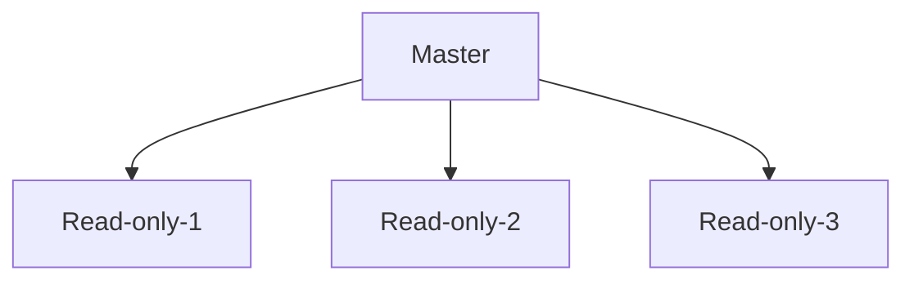

# Cloud Training
This is COHORT 5 cloud training

## AWS Regions
- Factor for selecting a region for provsioning the resources
- Workload consumers location

### AWS Global and Region scoped services

- AWS has some services that are global, meaning they are not limited by region
  - IAM
  - Route 53 (DNS)
  - CloudFront
- AWS servises are region0-scoped like lambda, EC2 and more!
- 

## IAM

- Billing IAM
- Polciy for each IAM account
- Fedration for accpount management
- Manage policy  
- Permission boundry 
  

## IAM policy
- Inline or manage policy
- Deny always Wins instead of ALLOW 
- Policy lives within AWS account.


## Managing multiple Account - AWS Organizations
- SCP Service control policy can be applied by any node
- Master/Management Account remains unaffected by SCPs 

## New AWS account creation
New AWS account creation process
  - Independent account creation
  - Under AWS Oraganization
**Why are limits/Quota important?**

## Users and Groups
  - Groups cannot be part of other groups
  - only Users can be added to the group.

## Sample code enable autocomplete for AWS
``` 
echo -e "\nexport PATH=/usr/local/bin/:\$PATH\n" >> .profile 
complete -C '/usr/local/bin/aws_completer' aws
cat ~/.profile
```
## create the role 
-  Create role **role-npls** without any access or policy attached.
-  create profile to allow list IAM user

```

{
	"Version": "2012-10-17",
	"Statement": [
		{
			"Sid": "VisualEditor0",
			"Effect": "Allow",
			"Action": "iam:ListUsers",
			"Resource": "*"
		}
	]
}

```

## Create EC2 instance and connect to the Instance

```

[ec2-user@ip-172-31-26-224 ~]$ aws configure
AWS Access Key ID [None]: 
AWS Secret Access Key [None]: 
Default region name [None]: us-west-2
Default output format [None]: json
[ec2-user@ip-172-31-26-224 ~]$ ***aws sts get-caller-identity***
{
    "UserId": "ZXCWWEDSDSD242424AA:i-073b3b953f37c8dfd",
    "Account": "99999999999",
    "Arn": "arn:aws:sts::99999999999:assumed-role/role-npls/i-073b3b953f37c8dfd"
}

```

## IAM Assume role
- create policy with STS assume role to allow swtich roles 
- Create EC2 assume with example for terraform
```
data "aws_iam_policy_document" "ec2_assume_role_policy" {
  statement {
    actions = [
      "sts:AssumeRole",
    ]

    principals {
      type        = "Service"
      identifiers = ["ec2.amazonaws.com"]
    }
  }
}
```


## Permission boundary
- User action will be restricted from access AWS service
- Priviledge escalation
- Effective permissions with boundry 
- actual permission of the user is effectively limited by the permssion boundry.
- Permission boundry is configured to allow or deny AWS service or certain function


## IAM vs AWS cognito
- IAM is for cloud access management
- AWS cognito allow to manage credentails and application can use the service to authenticate


## Setting up VM and VSCODE
- Setup .profile with Access_key,secret key and aws region 
- source .profile to setup the access to AWS 
- Run command ```aws sts get-caller-identity``` below is sample output
```
training@ip-172-31-21-113:~/cloud-training/cloud-training$ aws sts get-caller-identity
{
    "UserId": "AIDA6AK5B2HL75ALAMT77",
    "Account": "962804699607",
    "Arn": "arn:aws:iam::962804699607:user/participant-17"
}
```
- Add two extension to VS CODE
  - terraform
  - docker


# Excercise 2b:
- create new policy with permission shown 
- create new users policy-user
- Attach policy to the newly created user
- Create new policy with below policy:
```
{
	"Version": "2012-10-17",
	"Statement": [
		{
			"Sid": "VisualEditor0",
			"Effect": "Allow",
			"Action": [
				"dynamodb:PutItem",
				"dynamodb:GetItem",
				"dynamodb:UpdateItem"
			],
			"Resource": "*"
		}
	]
}
```

## Ec2 instances 
- EC2 Pricing
  - On-demand
    - Per hour pricing
  - Reserved
  - Spot Instances
- EC2 and Auto Scaling Labs
  - create EC2 Instance 
  - create IAM Image

### EC2 Rules
- Security group with inbound from remote ssh
- Key pair selected
- 


## RDS
- Resilient Durable Application Archtitechture 
- Disater recovery vai multi-AZ Setup 
- Manual Scaling - both vertical and horizontal 
- Vertical auto-scaling not support 
  - Storage Auto scaling can be enable
- RDS read Replica 
- Allow port 3306 from private IP on instance
- Create SG to allow EC2 instance to connect.


 
## Aurora RDS 
- Scale-out, distributed archtiecture
- Multi-AZ will have shared storage within 2-3 AZ's 
- Underline shared storage.
  
## S3 Storage
- Durabilty is not same as availablity
- Durability is probability that the object will remain intact and accessible after a period of year
- 100% durability - no possibility of the object being lost
- 90% - there's a 1 in 10 chance being lost
- 11 9's 99.99999999999%
- S3 gurantees 11 9's of durability 
- Out of 1 million object loss one file in 10 years
- S3 buckets have policy as well 
- globally unique filename
- WORM (write only read mulitple ) usage 
- Uses global namespaces
  
### S3 Storage class
- S3 Standard 
  - Default class
  - Active, Frequently accessed data
  - $0.0210/GBkv
  - >= 3 AZ's
- S3 intelligent-Tiering
  - Data with changing access pattern


|S3 Standard|S3 Intelligent Tiering|S3 Standard IA| S3 One Zone IA| S3 Glacier| S3 Glacier Deep Archive|
|:----|:----|:----|:----|:----|:----| 
|<ol><li>Infrequent</li><li>Active, frequently accessed data</li><li>Milliseconds access</li><li>> 3 AZ</li><li>Cost $0.0210/GB/month</li></ol>|<ol><li>Data with changing access patterns</li><li>Milliseconds access</li><li>>3 AZ</li><li>Cost: $0.0210 to $0.0125/GB</li><li>Monitoring fee per obj.</li><li>Min. storage duration</ol>|<ol><li>Infrequently accessed data</li><li>Milliseconds access</li><li>>3 AZ</li><li>Cost: $0.0125/GB</li><li>Retrieval fee per GB</li><li>Min. storage duration</li><li>Min. object size</ol>|<ol><li>Re-creatable, less accessed data</li><li>Milliseconds access</li><li>1AZ</li><li>Cost: $0.0100/GB</li><li>Retrieval fee per GB</li><li>Min. storage duration</li><li>Min. object size</ol>|<ol><li>Archive data</li><li>Select minutes or hours</li><li>>3 AZ</li><li>Cost: $0.0040/GB</li><li>Retrieval fee per GB</li><li>Min. storage duration</li><li>Min. object size</ol>|<ol><li>Archive data</li><li>Select 12 or 48 hours</li><li>>3 AZ</li><li>Cost: $0.00099/GB</li><li>Retrieval fee per GB</li><li>Min. storage duration</li><li>Min. object size</ol>|


## VPC 
- CIDR calculation for example (2^(32-24) = 2^8 = 256)
- CIDR Block : 10.0.0.0/24 
  - Start: 10.0.0.0
  - Last: 10.0.0.255
- CIDR Block : 10.0.0.0/26
  - Start - 10.0.0.0
  - Last - 10.0.0.63
- Example VPC creation:
  - CIDR block: 10.0.0.0/28
    - pub-a: 10.0.0.15/28
    - pub-b: 10.0.0.16/28
    - prv-a: 10.0.0.32/28
    - prv-b: 10.0.0.48/28
- VPC endpoint help the service to allow connectivity 
  - Enable Users to privately connect VPC tp support AWS services (like S3)
- VPC and regions
  - VPCs are specific to a given region
  - i.e. - a single VPC can not span multiple regions
  - However, it’s common to have separate VPCs in different regions for performance, compliance and DR purposes
  - VPC peering - can connect VPCs in different regions using this
  - Default limit of VPCs: 5 per region per account
- Subnets facts
  - Subnets segment VPC address ranges even further.
  - Subnets can exist within one and only one Availability Zone.
  - Subnet CIDR blocks within a VPC must not overlap.
  - Subnet inbound and outbound traffic can be restricted using NACLs.
  - Recommendation: Allocate substantially more IPs for private subnets than for public subnets.
- Internet Gateway
  - Allows resources (e.g., EC2 instances) in a VPC connect to the Internet
  - It scales horizontally and is highly available and redundant
  - Must be created separately from a VPC
  - One VPC can only be attached to one IGW and vice versa
  - Internet Gateways on their own do not allow Internet access...
  - Route tables must also be edited!
- NAT Gateway 
  - NAT gateway is created in each AZ
  - Elastic IP is allocated to NAT gateway
  - 

## ElastiCache
- The same way RDS is to get managed Relational Databases, ElastiCache is to get managed Redis or Memcached
- Caches are in-memory databases with high performance, low latency
- Helps reduce load off databases for read intensive workloads
- AWS takes care of OS maintenance / patching, optimizations, setup, configuration, monitoring, failure recovery and backups
- Redis vs Memcache
  
|Redis|Memcached|
|:-----|:---------|
|<ul><li>Sub-millisecond latency</li><li>Supports complex data types (sorted sets,hashes, bitmaps, hyperlog, geospatial index)</li><li>Multi AZ with Auto-Failover, supportssharding</li><li>Read Replicas for scalability and HA</li><li>Data Durability using AOF persistence</li><li>Backup and restore features</li></ul>|<ul><li>Sub-millisecond latency</li><li>Support only simple data types (string, objects)</li><li>Multi-node for sharding</li><li>Non persistent</li><li>No backup and restore</li><li>Multi-threaded architecture</li></ul>|


## DynamoDB
key consideration for dynamoally db service:
- Enventual consistency 
- Strong consistency 
- Potential usage: quick lookup with high concurrency with sub milliseconds response 


## Infrastructure as Code
- Cloud Formation - IaC for AWS was released in 2011, which of course only worked with AWS
- However, the need for a cloud-agnostic IaC provider was still present
- So that we could provision resources across different providers such as Microsoft Azure, GCP, in addition to AWS
  
### Teraform config
- Use profile in provider template file for autehnticate
- Use tfvar files to register 
