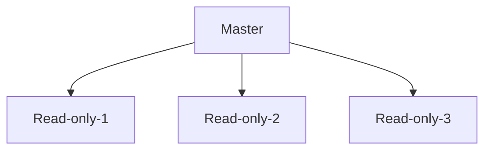

# Cloud Training
This is COHORT 5 cloud training

## AWS Regions
- Factor for selecting a region for provsioning the resources
- Workload consumers location

### AWS Global and Region scoped services

- AWS has some services that are global, meaning they are not limited by region
  - IAM
  - Route 53 (DNS)
  - CloudFront
- AWS servises are region0-scoped like lambda, EC2 and more!
- 

## IAM

- Billing IAM
- Polciy for each IAM account
- Fedration for accpount management
- Manage policy  
- Permission boundry 
  

## IAM policy
- Inline or manage policy
- Deny always Wins instead of ALLOW 
- Policy lives within AWS account.


## Managing multiple Account - AWS Organizations
- SCP Service control policy can be applied by any node
- Master/Management Account remains unaffected by SCPs 

## New AWS account creation
New AWS account creation process
  - Independent account creation
  - Under AWS Oraganization
**Why are limits/Quota important?**

## Users and Groups
  - Groups cannot be part of other groups
  - only Users can be added to the group.

## Sample code enable autocomplete for AWS
``` 
echo -e "\nexport PATH=/usr/local/bin/:\$PATH\n" >> .profile 
complete -C '/usr/local/bin/aws_completer' aws
cat ~/.profile
```
## create the role 
-  Create role **role-npls** without any access or policy attached.
-  create profile to allow list IAM user

```

{
	"Version": "2012-10-17",
	"Statement": [
		{
			"Sid": "VisualEditor0",
			"Effect": "Allow",
			"Action": "iam:ListUsers",
			"Resource": "*"
		}
	]
}

```

## Create EC2 instance and connect to the Instance

```

[ec2-user@ip-172-31-26-224 ~]$ aws configure
AWS Access Key ID [None]: 
AWS Secret Access Key [None]: 
Default region name [None]: us-west-2
Default output format [None]: json
[ec2-user@ip-172-31-26-224 ~]$ ***aws sts get-caller-identity***
{
    "UserId": "ZXCWWEDSDSD242424AA:i-073b3b953f37c8dfd",
    "Account": "99999999999",
    "Arn": "arn:aws:sts::99999999999:assumed-role/role-npls/i-073b3b953f37c8dfd"
}

```

## IAM Assume role
- create policy with STS assume role to allow swtich roles 
- Create EC2 assume with example for terraform
```
data "aws_iam_policy_document" "ec2_assume_role_policy" {
  statement {
    actions = [
      "sts:AssumeRole",
    ]

    principals {
      type        = "Service"
      identifiers = ["ec2.amazonaws.com"]
    }
  }
}
```


## Permission boundary
- User action will be restricted from access AWS service
- Priviledge escalation
- Effective permissions with boundry 
- actual permission of the user is effectively limited by the permssion boundry.
- Permission boundry is configured to allow or deny AWS service or certain function


## IAM vs AWS cognito
- IAM is for cloud access management
- AWS cognito allow to manage credentails and application can use the service to authenticate


## Setting up VM and VSCODE
- Setup .profile with Access_key,secret key and aws region 
- source .profile to setup the access to AWS 
- Run command ```aws sts get-caller-identity``` below is sample output
```
training@ip-172-31-21-113:~/cloud-training/cloud-training$ aws sts get-caller-identity
{
    "UserId": "AIDA6AK5C3H75ALAMT77",
    "Account": "96981224699607",
    "Arn": "arn:aws:iam::96981224699607:user/participant-17"
}
```
- Add two extension to VS CODE
  - terraform
  - docker


# Excercise 2b:
- create new policy with permission shown 
- create new users policy-user
- Attach policy to the newly created user
- Create new policy with below policy:
```
{
	"Version": "2012-10-17",
	"Statement": [
		{
			"Sid": "VisualEditor0",
			"Effect": "Allow",
			"Action": [
				"dynamodb:PutItem",
				"dynamodb:GetItem",
				"dynamodb:UpdateItem"
			],
			"Resource": "*"
		}
	]
}
```

## Ec2 instances 
- EC2 Pricing
  - On-demand
    - Per hour pricing
  - Reserved
  - Spot Instances
- EC2 and Auto Scaling Labs
  - create EC2 Instance 
  - create IAM Image

### EC2 Rules
- Security group with inbound from remote ssh
- Key pair selected
- 


## RDS
- Resilient Durable Application Archtitechture 
- Disater recovery vai multi-AZ Setup 
- Manual Scaling - both vertical and horizontal 
- Vertical auto-scaling not support 
  - Storage Auto scaling can be enable
- RDS read Replica 
- Allow port 3306 from private IP on instance
- Create SG to allow EC2 instance to connect.


 
## Aurora RDS 
- Scale-out, distributed archtiecture
- Multi-AZ will have shared storage within 2-3 AZ's 
- Underline shared storage.
  
## S3 Storage
- Durabilty is not same as availablity
- Durability is probability that the object will remain intact and accessible after a period of year
- 100% durability - no possibility of the object being lost
- 90% - there's a 1 in 10 chance being lost
- 11 9's 99.99999999999%
- S3 gurantees 11 9's of durability 
- Out of 1 million object loss one file in 10 years
- S3 buckets have policy as well 
- globally unique filename
- WORM (write only read mulitple ) usage 
- Uses global namespaces
  
### S3 Storage class
- S3 Standard 
  - Default class
  - Active, Frequently accessed data
  - $0.0210/GBkv
  - >= 3 AZ's
- S3 intelligent-Tiering
  - Data with changing access pattern


|S3 Standard|S3 Intelligent Tiering|S3 Standard IA| S3 One Zone IA| S3 Glacier| S3 Glacier Deep Archive|
|:----|:----|:----|:----|:----|:----| 
|<ol><li>Infrequent</li><li>Active, frequently accessed data</li><li>Milliseconds access</li><li>> 3 AZ</li><li>Cost $0.0210/GB/month</li></ol>|<ol><li>Data with changing access patterns</li><li>Milliseconds access</li><li>>3 AZ</li><li>Cost: $0.0210 to $0.0125/GB</li><li>Monitoring fee per obj.</li><li>Min. storage duration</ol>|<ol><li>Infrequently accessed data</li><li>Milliseconds access</li><li>>3 AZ</li><li>Cost: $0.0125/GB</li><li>Retrieval fee per GB</li><li>Min. storage duration</li><li>Min. object size</ol>|<ol><li>Re-creatable, less accessed data</li><li>Milliseconds access</li><li>1AZ</li><li>Cost: $0.0100/GB</li><li>Retrieval fee per GB</li><li>Min. storage duration</li><li>Min. object size</ol>|<ol><li>Archive data</li><li>Select minutes or hours</li><li>>3 AZ</li><li>Cost: $0.0040/GB</li><li>Retrieval fee per GB</li><li>Min. storage duration</li><li>Min. object size</ol>|<ol><li>Archive data</li><li>Select 12 or 48 hours</li><li>>3 AZ</li><li>Cost: $0.00099/GB</li><li>Retrieval fee per GB</li><li>Min. storage duration</li><li>Min. object size</ol>|


## VPC 
- CIDR calculation for example (2^(32-24) = 2^8 = 256)
- CIDR Block : 10.0.0.0/24 
  - Start: 10.0.0.0
  - Last: 10.0.0.255
- CIDR Block : 10.0.0.0/26
  - Start - 10.0.0.0
  - Last - 10.0.0.63
- Example VPC creation:
  - CIDR block: 10.0.0.0/28
    - pub-a: 10.0.0.15/28
    - pub-b: 10.0.0.16/28
    - prv-a: 10.0.0.32/28
    - prv-b: 10.0.0.48/28
- VPC endpoint help the service to allow connectivity 
  - Enable Users to privately connect VPC tp support AWS services (like S3)
- VPC and regions
  - VPCs are specific to a given region
  - i.e. - a single VPC can not span multiple regions
  - However, it’s common to have separate VPCs in different regions for performance, compliance and DR purposes
  - VPC peering - can connect VPCs in different regions using this
  - Default limit of VPCs: 5 per region per account
- Subnets facts
  - Subnets segment VPC address ranges even further.
  - Subnets can exist within one and only one Availability Zone.
  - Subnet CIDR blocks within a VPC must not overlap.
  - Subnet inbound and outbound traffic can be restricted using NACLs.
  - Recommendation: Allocate substantially more IPs for private subnets than for public subnets.
- Internet Gateway
  - Allows resources (e.g., EC2 instances) in a VPC connect to the Internet
  - It scales horizontally and is highly available and redundant
  - Must be created separately from a VPC
  - One VPC can only be attached to one IGW and vice versa
  - Internet Gateways on their own do not allow Internet access...
  - Route tables must also be edited!
- NAT Gateway 
  - NAT gateway is created in each AZ
  - Elastic IP is allocated to NAT gateway
  - 

## ElastiCache
- The same way RDS is to get managed Relational Databases, ElastiCache is to get managed Redis or Memcached
- Caches are in-memory databases with high performance, low latency
- Helps reduce load off databases for read intensive workloads
- AWS takes care of OS maintenance / patching, optimizations, setup, configuration, monitoring, failure recovery and backups
- Redis vs Memcache
  
|Redis|Memcached|
|:-----|:---------|
|<ul><li>Sub-millisecond latency</li><li>Supports complex data types (sorted sets,hashes, bitmaps, hyperlog, geospatial index)</li><li>Multi AZ with Auto-Failover, supportssharding</li><li>Read Replicas for scalability and HA</li><li>Data Durability using AOF persistence</li><li>Backup and restore features</li></ul>|<ul><li>Sub-millisecond latency</li><li>Support only simple data types (string, objects)</li><li>Multi-node for sharding</li><li>Non persistent</li><li>No backup and restore</li><li>Multi-threaded architecture</li></ul>|


## DynamoDB
key consideration for dynamoally db service:
- Enventual consistency 
- Strong consistency 
- Potential usage: quick lookup with high concurrency with sub milliseconds response 


## Infrastructure as Code
- Cloud Formation - IaC for AWS was released in 2011, which of course only worked with AWS
- However, the need for a cloud-agnostic IaC provider was still present
- So that we could provision resources across different providers such as Microsoft Azure, GCP, in addition to AWS
  
### Teraform config
- Use profile in provider template file for autehnticate
- Use tfvar files to register 


## Serverless
- Serverless does nopically t mean that there are no servers
- Rather, it's a paradigm in which developers no longer have to directly manage servers
- But servers are still being used in the background - you as a developer just do not see them
- API gateway, Fargate, step functions 
- Essentially anything  that is managed service is considered serverless b/c you typically 
- AWS Serverless Service
  - AWS lamdba
  - Fargate - Serverss for ECS-EKS provides infrastruture to run docker containers
  - S3 - storage solution
  - More info is available at [https://aws.amazon.com/serverless/](https://aws.amazon.com/serverless/)

### Lambda
Lambda - why do we use them?
- Now, let's talk a bit more about ***lambdas...***
- Lambdas are ***virtual functions***, which means that there are no servers to manage
- Because lambdas ***run on-demand*** - only when invoked, this is very different than the EC2 cost model
- Lambdas have ***short execution*** periods - default of 3 seconds, with a max of 15 minutes (you can adjust this value within that range
- With Lambdas, ***scaling is automated***, if you need more lambda functions, AWS will automatically provision them for you

### Lambda case study - Netflix
|Statistic|Existing Ec2|Enhanced Lambda|
|:----|:----|:----| 
|Average Time to First <br/> Response of New Instance|3 minutes|2006 ms|
|Average Response Time of <br/>Warmed Instance|800 ms|1100 ms|
|Average Active Instances / Concurrent Executions|~1000 instances|<100 Preprocessor instances<br/><25 Concurrent Executions in Lambda|
|Average Daily Costs|<$100|<$100|

### Lambda use containers under the hood?

__**Yes and no! Per the doc here:**__
[https://dl.awsstatic.com/whitepapers/Overview-AWS-Lambda-Securitv.pdf](https://dl.awsstatic.com/whitepapers/Overview-AWS-Lambda-Securitv.pdf)
```
Execution environments are isolated from one another using several container-like technologies built into the Linux kernel, along with A WS proprietary isolation technologies. These technologies include: eg roups, namespaces, ch root, etc.. 
```

## AWS API Gateway
- AWS Lambda + API Gateway: No infrastructure to manage
- Support for the WebSocket Protocol
- Handle API versioning (v I, v2...)
- Handle different environments (dev,test, prod...)
- Handle security (Authentication and Authorization)
- Create API keys, handle request throttling
- Swagger / Open API import to quickly define APIs
- Transform and validate requests and responses
- Generate SDK and API specifications
- Cache API responses

## API Gateway Integrations - High Level
- Lambda Function
  - Invoke Lambda function
  - Easy way to expose REST API backed byAWS Lambda
- HTTP
  - Expose HTTP endpoints in the backend
  - Example: internal HTTP API on premise, Application Load Balancer...
  - Why? Add rate limiting, caching, user authentications, API keys, etc...
- AWS Service
  - Expose any AWS API through the API Gateway
  - Example: start an AWS Step Function workflow, post a message to SQS
  - Why? Add authentication, deploy publicly, rate control...


## Cloud Native

__**Cloud Native - what does that mean?**__

- **Story time**: when the cloud started to become popular in the mid 2000s (2005 or
so) everyone started to throw their applications on the cloud using the lift and shift
strategy - hoping to get the cost/performance benefits the cloud promised
  - *Key takeaway* - lift and shift == migrating to cloud w/ minimal changes to the
application before the migration
- But they found they were often getting ***higher costs and worse performance***, so
they soon realized that in order to get the benefits of running on the cloud they
had to **first re-architect** *their applications to run effectively on the cloud*
- And hence the term **cloud native** was born - basically it means that if your app is
cloud native then it is specifically architected to run on the cloud, and you can
therefore get the benefits of **lower costs/better performance** that the cloud
promises

### Cloud native - characteristics
- **The Twelve-Factor App**: Baseline best practices for designing & building web applications for portability and resilience.
  - [Reference: https://12factor.net/](https://12factor.net/)
- **Microservices**: Independently deployable services that do one thing well (Single Responsibility Principle).
- **Self-Service Infrastructure**: Platforms for rapid, repeatable, and consistent provisioning of ap^ environments and backing services.
- **API-based Collaboration**: Published and versioned APIs that allow interaction between services.
- **Anti-Fragile**: Systems that are resilient to stress and failure.

## Microservices 
__**Microservices + Monolith - definition**__
- To best define microservices, I think it helps to first compare it to the term
monolith
- A monolithic application is basically one gigantic application sharing a single
codebase (think: a single Git repository)
- What challenges would we face if for example, we were running all of
Amazon.com in a single codebase - a single Github repository perhaps?

### Monolith - solution...
- By breaking something down into more manageable pieces - microservices - we can better tackle the problem and deal with complexity.
- Microservices are the “smaller pieces” of the larger application

### Microservices characteristics
- Small, fully independent and autonomous application. Isolated from other MS’s, maybe even with own database.
- Responsible for a logical part of a larger application “ecosystem”. Singular responsibility.
- Can be any language. Developers on the same project can have completely different skill sets if necessary.
- Loosely coupled to other MS’s. Communicate with other MS’s using standardized protocols. Often a REST API or a message bus.
- People generally start with coarse grained services and then break them up into smaller and smaller pieces as the time goes by and they know more and more

### Microservices benefits
- By dividing and conquering w/ microservices, if we want to make a small change to the site, we would just update the microservice that is responsible for that portion of the site
- And the key here is that we would only need to redeploy that particular microservice, without disturbing/interfering with all the other stuff that powers amazon.com.
- This is as opposed to using a monolith where we would have to redeploy all of amazon.com for a small change which doesn’t make sense of course.
- __*One of the clear advantages of using microsen/ices is that it allows us to be <strong>more agile</strong>*__
  - *Agile means we can deploy quickly when changes need to be made, and respond to  the needs of the business faster!*


## Containers vs VMs revisited
- Both VMs and containers are essentially *"wrappers"* around our applications making it easier to run our apps on the cloud
- Containers allow us to share a copy of the OS between applications
-	Apps running inside a VM each have their own copy of the OS. Hence, VM’s are heavier
- Containers are lightweight, low overhead, and we can run more apps on a single server with containers
  
*Sidenote: VM’s offer better security than containers due to OS isolation*


## Docker Terminology 
- *DockerFile* is declarative file that contains information about **application code** --> **Docker Image** convert into __***Docker container***__
- *DockerFile* will live in application’s repository with source code.
- The source code + *DockerFile* will give us a Docker image
- Docker images are how we share our application
- An instance of a Docker image is a running container....this is a running instance of your application!
- Don’t worry if this is not clear yet, we will be playing with images and containers shortly..

### Docker Ecosystem
- Docker CLI
- Docker Engine
- Docker Images
  - Image is a template for docker container 

### Docker CLI - images
- ```docker build``` ... - used to build image from Dockerfile
- ```docker pull``` ... - to pull an image from a repo
- ```docker run``` ... - to run an image
- ```-it``` - interactive and gives you command prompt inside of container
- ```-p``` - port mapping, exposes port from inside container to hos
- ```-e``` - environment variable
- ```-v``` - volume mapping
- ```docker images``` - this will show you all of your images
- ```docker rmi``` ... - to delete an image (pass in the image name or id)
  - *Can't delete an image that has a running container (a running instance)*
- ```docker ps``` - to list running containers
- Use ```-a``` arg to see stopped containers as well
- ```docker inspect```... - to inspect a running container
- ```docker logs``` ... - to view console output of a container
- ```docker rm ```... - to remove a container
- ```docker start/stop/restart```... - self explanatory
- Difference between stop and rm?
  - A container that's stopped can be restarted, not true if "rm"d (deleted)
  - If you stop a container, you will still see it in docker ps -a , but not if you used rm

#### Docker CLI - port mapping
- By default, when you run a container with docker run, it doesn't publish any of it's ports to the outside world - i.e., your localhost when running Docker Desktop
- Which makes sense because a container is it's own isolated environment!
- So, how do we expose that internal port?
- Through the '-p' flag (p for publish) when we do a docker run
- So, if we do docker run ~p 8080:80 that says map port 80 in the container to
- port 8080 on the Docker host - your localhost in this case
- ```docker run -p``` [host_port]:[container_port] [docker_image]
  - Example: ```docker run -it -p 27017:27017 mongo:4.0 /bin/bash```


### Docker image content
1. Minimal OS layer
2. Install apache and other component 
3. App related :*artifacts*
4. bootstrapping the :**app**


### Networks in Docker
- You can create Docker networks to allow containers to easily communicate.
- **Types**:
  - Bridge (default) - this one is created by Docker and containers go here by default. Not recommended for production. No container communication by name.
  - Bridge (user-defined) - Recommended for standalone containers running on the sam host. Containers can communicate by name.
  - Overlay - allows networking across Docker hosts. Works with Swarm.
- Networks are managed with the docker network ... commands
  - **Docker network** will show all commands,
- example **`docker nework ls`** will display all existing networks including 3 pre-defined networks.
- Containers are put into a network with the `--network` option in the docker run command.
- Existing containers can be put into a network with **docker network connect <network name> <container name>**


